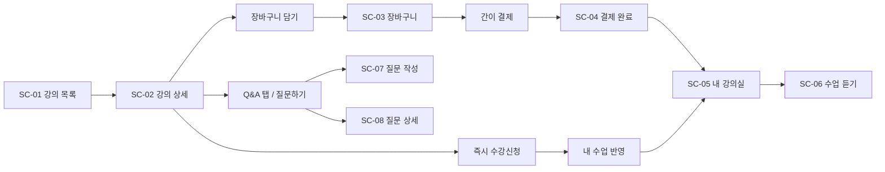

# UI/UX 고충실도 설계서 — 면접 인강 플랫폼 P1

> **근거 문서**: `기획서.md`, `요구사항명세서.md`, `요구사항-분석-및-수용수준.md` (상위 `docs/p1/`)  
> **목적**: 기획·SRS의 기능을 **누락 없이** 화면·컴포넌트·상태·플로우로 변환. 개발·디자인 핸드오프용.

---

## 0. 설계 원칙

| 원칙 | 적용 |
|------|------|
| **근거** | 본 문서의 화면·컴포넌트는 기획서 §3, SRS §2.1 FR/EIR, AC-F01~F07과 대응. 임의 기능 추가 없음. |
| **그리드** | 8px 베이스: 간격 8·16·24·32·40·48, 라운드 8·12·16, 컨테이너 최대폭 1200px(목록)·1280px(플레이어). |
| **톤** | Ed-tech / SaaS: 여백 넉넉, 계층 명확, Stripe·Notion 계열의 차분한 중립색 + 단일 액센트. |
| **접근성** | 본문 대비 4.5:1 이상, 포커스 링, 버튼 최소 터치 44×44px(모바일 대비). |
| **우선 단말** | 데스크톱 퍼스트, 브레이크포인트 768 / 1024. |

---

## 1. 요구사항 → 화면 매핑

| 구역 | SRS / 기획 | 화면 ID | 화면명 |
|------|------------|---------|--------|
| 검색 | FR-S01~S07, AC-F01 | **SC-01** | 강의 목록·검색 |
| 수강신청 | FR-E01, 기획 3.2 | **SC-02** | 강의 상세 |
| 장바구니 | FR-E02, AC-F03 | **SC-03** | 장바구니 |
| 간이 결제 | FR-E03, 기획 결제 완료 | **SC-04** | 결제 완료(간이) |
| 내 수업 | FR-M01~M04, AC-F05 | **SC-05** | 내 강의실 |
| 수업 듣기 | FR-V01~V05, AC-F06 | **SC-06** | 수업 듣기(플레이어) |
| Q&A | FR-Q01~Q05, AC-F07 | **SC-07** | 질문 작성 |
| Q&A | FR-Q03~Q05 | **SC-08** | 질문 상세·답변 |
| Q&A | FR-Q04 | **SC-09** | 질문 수정(본인) |
| 진입 | (전환 최적화, 기획 필수 아님) | **SC-00** | 랜딩(선택) |

**기획서 명시 탭 구조**: 강의 상세 = **소개 | 커리큘럼 | Q&A** (한 화면 내 탭, SC-02).

---

## 2. 정보 구조(IA) & 사용자 플로우

### 2.1 핵심 플로우 (SRS 1.3)



### 2.2 1차 CTA 우선순위

| 화면 | Primary CTA | Secondary |
|------|-------------|-----------|
| SC-01 | 카드 클릭 → 상세 | 필터 초기화 |
| SC-02 | 유료: **수강신청** / 무료: **무료로 수강하기** | 장바구니 담기 |
| SC-03 | **선택 강의 수강신청** 또는 **전체 결제하기** | 쇼핑 계속 |
| SC-04 | **내 수업으로 이동** | 강의 계속 찾기 |
| SC-05 | **이어보기** | — |
| SC-06 | (재생) | 목차에서 다음 영상 |

---

## 3. 화면별 상세 설계

### SC-00 랜딩 (선택, GC-04 데스크톱 우선)

- **목적**: 검색·목록(SC-01)으로 전환.
- **구역**: 히어로(헤드라인 + 부제) | 1행 CTA 2개: 「강의 둘러보기」→ SC-01, 「회원가입」(정책상 있을 경우) | 카테고리 칩 → SC-01 쿼리 연동.
- **카피 예**: 「취업 면접, 한 번에 준비하세요」 / 「기술·인성·PT 면접 강의를 만나보세요」

---

### SC-01 강의 목록·검색 — *FR-S01~S07, EIR-I01/O01*

**레이아웃 (데스크톱, 12 컬럼 그리드)**

```
┌─────────────────────────────────────────────────────────────┐
│ 헤더: 로고 | 강의 | 내 강의실 | 장바구니 | 계정              │
├──────────┬──────────────────────────────────────────────────┤
│ 필터 패널 │  검색창(전폭) + 정렬 드롭다운 + 결과 수            │
│ (280px)  │  ┌────┐ ┌────┐ ┌────┐ ┌────┐                       │
│          │  │카드│ │카드│ │카드│ │카드│  4열 그리드 gap 24px │
│ 카테고리  │  └────┘ └────┘ └────┘ └────┘                       │
│ 난이도    │  페이지네이션                                    │
│ 가격대    │                                                  │
│ (슬라이더)│                                                  │
└──────────┴──────────────────────────────────────────────────┘
```

| 컴포넌트 | 스펙 | 상태 |
|----------|------|------|
| **검색 입력** | 플레이스홀더「강의명, 강사로 검색」, Enter/아이콘 검색, 빈값 시 전체 | focus, filled |
| **카테고리** | 다중 선택 칩: 기술면접, 인성면접, PT면접, 영어면접, 직무별(IT/금융/마케팅…) | default, selected |
| **난이도** | 체크박스 그룹 또는 세그먼트: 초급·중급·고급 (SRS: 단일/다중) | — |
| **가격대** | 토글「무료만」「유료만」+ 쌍입력 min/max 또는 Range 슬라이더 (기획 §3.1) | 적용됨 배지 |
| **정렬** | 드롭다운: 최신순, 가격 낮은순, 가격 높은순, (선택) 인기순·평점순 | — |
| **뷰 전환** | 카드 / 리스트 (기획「카드/리스트 형태」) | — |
| **강의 카드** | 썸네일 16:9, 제목 2줄 말줄임, 강사명, **가격**, (데이터 있으면) 평점·수강생 수 | hover 그림자, 찜(선택) |
| **리스트 행** | 썸네일 120px, 동일 메타 가로 배치 | — |
| **페이징** | 하단: 이전 | 1 2 3 … | 다음 + page size 12/24 | disabled |
| **빈 상태** | 일러스트 + 「조건을 바꿔 다시 검색해 보세요」+ 필터 초기화 버튼 | empty |

**현실적 카드 예시 데이터**

- 「React 기술면접 실전 대비」·김민준·₩89,000·★4.8·1.2k명  
- 「인성면접 답변 구조화」·이서연·무료·★4.6

---

### SC-02 강의 상세 — *FR-E01, 기획 3.2 화면*

**레이아웃**

```
┌──────────────────────────────────────────────────────────────┐
│ 브레드크럼: 강의 > [카테고리] > 제목                           │
├──────────────────────┬───────────────────────────────────────┤
│ 썸네일 16:9 (대형)    │ 제목 H1                                │
│                      │ 강사명 · 난이도 · (예상 수강 시간)        │
│                      │ 가격 강조                                │
│                      │ [장바구니 담기] [수강신청 / 무료 수강]   │
├──────────────────────┴───────────────────────────────────────┤
│ 탭: 소개 | 커리큘럼 | Q&A                                      │
├──────────────────────────────────────────────────────────────┤
│ [소개] 강의 설명 리치텍스트 · 강사 소개(사진+약력)               │
│ [커리큘럼] 아코디언: 섹션 제목 ▼ 영상 목록(제목, 분:초)         │
│ [Q&A] 질문 리스트(제목, 작성자, 답변 수, 일자) [질문하기]       │
└──────────────────────────────────────────────────────────────┘
```

| 컴포넌트 | 스펙 |
|----------|------|
| **탭** | 3탭, 활성 시 하단 보더 2px 액센트 |
| **아코디언(커리큘럼)** | 섹션별 펼침, 영상 행에 재생 아이콘(수강 전 잠금 표시 선택) |
| **Sticky CTA 바 (모바일)** | 하단 고정 동일 2버튼 |
| **중복 수강** | 이미 수강 중이면 Primary를 「내 강의실에서 보기」로 대체 (FR-E04) |

---

### SC-03 장바구니 — *FR-E02*

| 요소 | 스펙 |
|------|------|
| 행 | 체크박스(일괄 결제용) | 썸네일 80px | 제목 링크→SC-02 | 가격 | 삭제(휴지통) |
| 하단 요약 | 선택 N개 · 소계 · **총액** |
| CTA | 「선택 상품 수강신청」 / 「전체 수강신청」→ 간이 결제 플로우 |
| 빈 상태 | 「담긴 강의가 없습니다」+ SC-01 링크 |

---

### SC-04 결제 완료(간이) — *GC-01, 기획 3.2*

- 전체 화면 또는 모달: 체크 아이콘 + 「수강신청이 완료되었습니다」(유료 문구: 「결제가 완료되었습니다(데모)」)
- **Primary**: 「내 수업 보기」→ SC-05
- Secondary: 「강의 더 둘러보기」→ SC-01

---

### SC-05 내 강의실 — *FR-M01~M04*

```
탭/필터: 전체 | 수강 중 | 수료 완료     정렬: 최근 수강순 · 가나다순(선택)

┌─────────────┐ ┌─────────────┐ ┌─────────────┐
│ 썸네일       │ │ 썸네일       │ │ 썸네일       │
│ 제목         │ │ 제목         │ │ 제목         │
│ ████████░░ 45% │ │ ██████████ 수료 │ │ 진행 중 뱃지  │
│ [이어보기]   │ │ [복습하기]   │ │ [이어보기]   │
└─────────────┘ └─────────────┘ └─────────────┘
```

| 컴포넌트 | 스펙 |
|----------|------|
| 진행 바 | 높이 8px, 라운드 풀, 액센트 채움 |
| 뱃지 | `수강 중` / `수료` (수료 시 초록 또는 네이비) |
| 빈 상태 | 「아직 수강 중인 강의가 없습니다」+ SC-01 CTA |

---

### SC-06 수업 듣기 — *FR-V01~V05*

**데스크톱 2열: 메인 8 + 사이드 4**

```
┌────────────────────────────────────┬─────────────────┐
│ 영상 플레이어 (16:9)                 │ 목차             │
│ 컨트롤: 재생·음량·전체화면           │ 섹션1            │
│ 속도: 0.5x 1x 1.25x 1.5x 2x         │  ○ 현재 영상 ←   │
│ (선택) 자막 on/off                  │  ○ 다음 영상     │
├────────────────────────────────────┤ 섹션2 …          │
│ 현재: 섹션명 · 영상 제목             │ 완료 체크 표시    │
│ (선택) 구간 반복 A-B                │                  │
└────────────────────────────────────┴─────────────────┘
```

| 컴포넌트 | 스펙 |
|----------|------|
| 목차 행 | 현재 영상: 배경 하이라이트 + 왼쪽 보더 3px |
| 진도 저장 | 재생 중 주기 저장(UX 피드백 불필요, 오류 시 토스트) |
| 완료 | 90% 시청 시 행에 ✓ (FR-V05) |
| 상단 링크 | 「← 내 강의실」 |

---

### SC-07 질문 작성 — *FR-Q02, EIR-I06*

- 필드: 제목(필수, max 200) | 본문(필수) | **비공개 질문** 체크(기획 §3.5)
- Primary「등록」| 취소 → SC-02 Q&A 탭

---

### SC-08 질문 상세 — *FR-Q03, Q05*

- 질문 블록: 제목, 본문, 작성자, 작성일·수정일
- 답변 리스트: 카드별 답변자·일자·본문
- **본인 질문**: 「수정」「삭제」(삭제 확인 모달) — FR-Q04
- 하단: 답변 작성 textarea + 「답변 등록」

---

### SC-09 질문 수정 — *FR-Q04*

- SC-08과 동일 폼에 제목·본문 프리필, Primary「저장」

---

## 4. 공통 컴포넌트 라이브러리

### 4.1 버튼

| 토큰 | 용도 | 스타일 |
|------|------|--------|
| **Primary** | 수강신청, 결제, 이어보기 | 채움 액센트, 높이 40px, 패딩 16px 24px, radius 8px |
| **Secondary** | 장바구니, 취소 | 보더 1px, 배경 투명 |
| **Tertiary / Ghost** | 텍스트 링크형 | 밑줄 on hover |
| **Danger** | 삭제 확인 | 빨강 계열, 확인 모달 내에서만 |

상태: default | hover(밝기 -6%) | active | disabled(opacity 0.5) | loading(스피너)

### 4.2 입력

| 타입 | 높이 | 비고 |
|------|------|------|
| 텍스트/검색 | 40px | border #E5E7EB, focus 링 2px 액센트 |
| Select | 40px | 화살표 8px |
| Textarea | min 120px | 질문·답변 |
| Range(가격) | — | 듀얼 핸들 + 숫자 표시 |
| Checkbox / Chip | 36px 터치 영역 | |

### 4.3 카드

- 배경 #FFFFFF, border #E5E7EB, shadow `0 1px 3px rgba(0,0,0,0.06)`, hover `0 8px 24px rgba(0,0,0,0.08)`
- 내부 패딩 16px, 썸네일 상단 또는 좌측

### 4.4 탭 · 아코디언 · 진행률 · 페이지네이션

- **탭**: 텍스트 14px medium, 활성 색 액센트 + 2px underline
- **아코디언**: 헤더 48px, 아이콘 회전
- **Progress**: 8px 높이, 배경 #E5E7EB
- **Pagination**: 숫자 버튼 36×36, 현재 페이지 filled

### 4.5 피드백

- **토스트**: 성공(초록)·오류(빨강)·정보, 하단 중앙, 3s
- **모달**: 삭제 확인, 중복 장바구니/수강(409) 메시지
- **스켈레톤**: 목록·상세 로딩 시 카드 형태 스켈레톤

---

## 5. 스타일 가이드 (토큰)

### 5.1 색상 (예시 — 대비 WCAG AA)

| 토큰 | Hex | 용도 |
|------|-----|------|
| `--text-primary` | #111827 | 본문 |
| `--text-secondary` | #6B7280 | 보조 |
| `--border` | #E5E7EB | 구분선 |
| `--surface` | #FFFFFF | 카드 |
| `--bg` | #F9FAFB | 페이지 배경 |
| `--accent` | #2563EB | CTA (또는 브랜드 녹 #059669 등 단일 유지) |
| `--accent-hover` | #1D4ED8 | |
| `--success` | #059669 | 완료·수료 |
| `--error` | #DC2626 | 오류·삭제 |

### 5.2 타이포그래피

| 스타일 | 크기 | 굵기 | 용도 |
|--------|------|------|------|
| Display | 32–40px | 700 | 랜딩 히어로 |
| H1 | 28px | 700 | 상세 제목 |
| H2 | 20px | 600 | 섹션 |
| Body | 16px | 400 | 본문 |
| Small | 14px | 400 | 메타·캡션 |
| Caption | 12px | 500 | 뱃지·라벨 |

폰트: 시스템 스택 또는 Pretendard / Inter.

### 5.3 간격 (8px)

4, 8, 12, 16, 24, 32, 40, 48, 64 — 섹션 간 48–64, 카드 내부 16–24.

---

## 6. 반응형 (GC-04 보완)

| 브레이크포인트 | 변경 |
|----------------|------|
| <1024px | SC-01 필터를 드로어(햄버거)로 수축 |
| <768px | 강의 상세: 썸네일 상단 풀폭, CTA 하단 sticky 바 |
| <768px | 플레이어: 목차를 탭「목차」로 하단 시트 |

---

## 7. 인수 조건(UI 관점) 체크리스트

| AC | UI 확인 항목 |
|----|----------------|
| AC-F01 | 필터·정렬·페이징 조합 시 목록 갱신, 총 건수 표시 |
| AC-F02 | 상세에서 커리큘럼·가격·강사 노출 |
| AC-F03 | 담기/삭제/중복 시 토스트·모달 |
| AC-F04 | 수강 후 SC-05 반영, 중복 시 차단 메시지 |
| AC-F05 | 진도율·수료·이어보기 버튼 명확 |
| AC-F06 | 속도·전체화면·목차·완료 표시 |
| AC-F07 | 질문 CRUD·본인만 수정삭제·답변 등록 |

---

## 8. 구현 갭 (현 코드 대비 권장 보강)

기획/SRS 대비 프론트에 **추가 구현 권장** 항목:

1. **SC-02**: 소개/커리큘럼/Q&A **탭** 분리, 강사 소개·예상 수강 시간 영역.  
2. **SC-01**: **가격대** 슬라이더·무료/유료 토글, **리스트 뷰**, **페이지네이션 UI**.  
3. **SC-04**: 유료 일괄 신청 후 **결제 완료 전용 화면**.  
4. **SC-05**: **수강 중/수료** 탭·정렬.  
5. **SC-06**: **재생 속도**, **전체 화면**, (선택) **자막**, **구간 반복**.  
6. **SC-07**: **비공개 질문** 체크.  
7. **SC-08**: **질문 수정·삭제**(본인), **삭제 확인 모달**.  
8. 카드에 **평점·수강생 수**는 API 필드 있을 때만 표시.

---

## 9. Figma 작업 시 권장 프레임 목록

1. SC-01 — default / 필터 적용 / empty / loading  
2. SC-02 — 탭 3종(소개·커리큘럼·Q&A)  
3. SC-03 — 1건 이상 / empty  
4. SC-04  
5. SC-05 — 탭 수강중·수료  
6. SC-06 — 플레이어 + 목차  
7. SC-07 · SC-08(본인·타인) · SC-09  
8. 공통: 버튼 상태, 토스트, 모달

---

*본 설계서는 기획서·요구사항명세서를 해석한 결과이며, API 필드 부족 시 표시 항목은 백엔드와 동기화 후 조정한다.*
