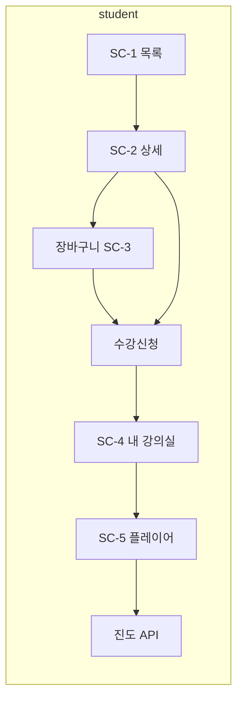
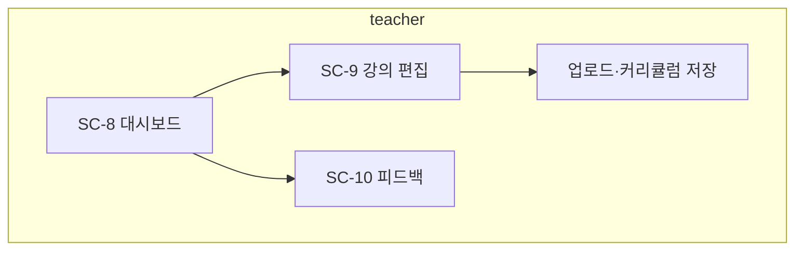

# UI/UX 고충실도 설계서 — P2 LMS

**근거**: `기획서.md`, `요구사항명세서.md`  
**구현**: `p2/frontend/src` (라우트·페이지·`index.css` 토큰)

---

## 0. 설계 원칙

| 원칙 | 적용 |
|------|------|
| 레이아웃 | 역할별 상단 내비·최대 폭(목록·대시보드 약 1024px, 플레이어 1280px 가이드) |
| 톤 | 교육용 SaaS: 중립 배경 + 단일 액센트(브랜드 컬러 변수) |
| 접근성 | 대비·포커스·버튼 최소 터치 영역 고려 |
| 반응형 | 데스크톱 우선, 좁은 폭에서 그리드 1열 전환 |

---

## 1. 화면–역할 매핑

| 화면 ID | 화면명 | 경로(예) | 역할 |
|---------|--------|-----------|------|
| SC-0 | 로그인 / 회원가입 | `/login`, `/signup` | 전체 |
| SC-1 | 홈·강의 목록 | `/`, `/courses` | 공개 |
| SC-2 | 강의 상세 | `/courses/:id` | 공개(수강 버튼은 학생) |
| SC-3 | 장바구니 | `/cart` | student |
| SC-4 | 내 강의실 | `/dashboard` | student |
| SC-5 | 수업 듣기 | `/learn/:enrollmentId` | student |
| SC-6 | Q&A 작성·상세 | `/courses/.../questions`, `/questions/:id` | student |
| SC-7 | 피드백 | `/feedback`, `/feedback/new` 등 | student |
| SC-8 | 강사 대시보드·내 강의 | `/teacher`, `/teacher/courses` | teacher |
| SC-9 | 강의 편집 폼·커리큘럼 에디터 | `/teacher/courses/new`, `…/edit` | teacher |
| SC-10 | 강사 피드백 | `/teacher/feedback` | teacher |
| SC-11 | 관리자 대시보드·회원·강의 | `/admin`, `/admin/users`, `/admin/courses` | admin |

---

## 2. 핵심 사용자 플로우

---

## 3. 화면별 요약

### SC-2 강의 상세

- 탭: 소개 | 커리큘럼(아코디언) | Q&A  
- 학생: 장바구니·수강신청(로그인 시)  
- 커리큘럼 데이터: API `sections` (서버가 `curriculum_json` 파싱)

### SC-5 수업 듣기

- 좌측(또는 상단): 비디오 플레이어, 재생 속도, 전체 화면  
- 우측: 목차 리스트(현재 영상 강조)  
- 하단 탭: 목차(섹션별) | Q&A  
- 주기적으로 `PUT …/progress` 호출, 완료 시 체크·대시보드 진도율에 반영

### SC-4 내 강의실

- 카드: 썸네일, 제목, 진도 바·%, 수강 중/수료 뱃지, 이어보기 / Q&A 링크

### SC-8~10 강사

- 대시보드: 통계 카드, 빠른 링크  
- 강의 폼: 제목·설명·가격·공개·썸네일·커리큘럼 에디터(섹션·영상·URL)  
- 피드백: 목록·상세·상태·스레드

### SC-11 관리자

- 통계 숫자 카드  
- 사용자 테이블·역할 변경  
- 전체 강의 테이블(비공개 표시)

---

## 4. 상태·API 연동

- 인증: 로컬 스토리지 JWT, `api.js` 요청 시 `Authorization` 헤더  
- 장바구니·수강·진도: Redux 또는 페이지 단위 `fetch` + 목록 재조회  
- 프록시: Vite → 백엔드 `PORT` (`p2/README.md`)

---

## 5. 문서 이력

| 버전 | 내용 |
|------|------|
| 2.0 | P2 구현 화면 기준으로 재작성(P1 면접 인강 SC 상세 제거) |
